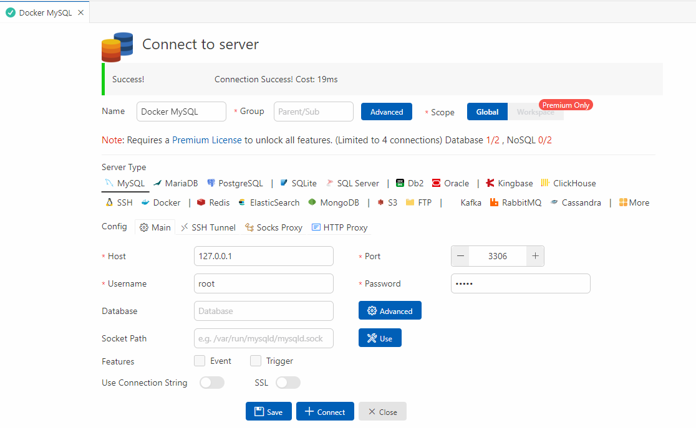

# iot-database-2025
IoT 개발자 데이터베이스 저장소

## 1일차
- 데이터베이스 시스템
    - 통합된 데이터를 저장해서 운영하면서, 동시에 여러 사람이 사용할 수 있도록 하는 시스템
    - 실시간 접근, 계속 변경, 동시 공유, 내용으로 참조(물리적으로 떨어져 있어도 사용 가능)

    - DBMS : SQL Server, Oracle, MySQL, MariaDB, MongoDB...

- 데이터베이스 언어
    - SQL(Structured Query Language) : 구조화된 질의 언어(프로그래밍 언어와 동일)
        - DDL : DB나 테이블 생성, 수정, 삭제
        - DML : 데이터 검색, 삽입, 수정, 삭제 언어
        - DCL : 권한 부여, 해제 제어 언어

- MySQL 설치(Docker)
    1. 파워쉘 오픈, 도커 확인
        ```shell
        > docker -v
        Docker version 27.5.1, build 9f9e405
        ```
    2. MySQL Docker 이미지 다운로드
        ```shell
        > docker pull mysql
        Using default tag: latest
        latest: Pulling from library/mysql
        893b018337e2: Download complete
        431b106548a3: Download complete
        df1ba1ac457a: Download complete
        23d22e42ea50: Download complete
        Digest: sha256:146682692a3aa409eae7b7dc6a30f637c6cb49b6ca901c2cd160becc81127d3b
        Status: Downloaded newer image for mysql:latest
        docker.io/library/mysql:latest
        ```
    3. MySQL Image 확인
        ```shell
        > docker images
        ```
    4. Docker 컨테이너에 생성
        - MySQL Port 번호는 3306이 기본
        - Oracle Port 1521
        - SQL Server 1433
        ```shell
        > docker run --name mysql-container -e MYSQL_ROOT_PASSWORD=12345 -d -p 3306:3306 mysql:latest
        ```
    5. 컨테이너 확인
        ```shell
        > docker ps -a
        CONTAINER ID   IMAGE          COMMAND                   CREATED          STATUS          PORTS                               NAMES
        9f109d3a14a2   mysql:latest   "docker-entrypoint.s…"   19 seconds ago   Up 18 seconds   0.0.0.0:3306->3306/tcp, 33060/tcp   mysql-container
        ```
    6. Docker 컨테이너 시작, 중지, 재시작
        ```shell
        > docker stop mysql-container       # 중지
        > docker start mysql-container      # 시작
        > docker restart mysql-container    # 재시작
        ```
    7. MySQL Docker 컨테이너 접속
        ```shell
        > docker exec -it mysql-container bash      # bash 리눅스의 powershell
        bash-5.1# mysql -u root -p
        Enter password:
        Welcome to the MySQL monitor.  Commands end with ; or \g.
        Your MySQL connection id is 9
        Server version: 9.2.0 MySQL Community Server - GPL

        Copyright (c) 2000, 2025, Oracle and/or its affiliates.

        Oracle is a registered trademark of Oracle Corporation and/or its
        affiliates. Other names may be trademarks of their respective
        owners.

        Type 'help;' or '\h' for help. Type '\c' to clear the current input statement.

        mysql> show databases;
        +--------------------+
        | Database           |
        +--------------------+
        | information_schema |
        | mysql              |
        | performance_schema |
        | sys                |
        +--------------------+
        4 rows in set (0.02 sec)
        ```


- Workbench 설치
    - https://dev.mysql.com/downloads/workbench/
    - MySQL Installer에서 Workbench, Sample 만 설치

    - Workbench 실행 후
        1. MySQL Connections + 클릭

- 관계 데이터 모델
    - 3단계 DB 구조 : 외부 스키마(실세계와 매핑) -> 개념 스키마(DB논리적 설계) -> 내부 스키마(물리적 설계) -> DB
    - 모델에 쓰이는 용어
        - 릴레이션 : 테이블
        - 속성 : column
        - 튜플 : row
        - 관계 : 릴레이션 간의 부모, 자식 연관

    - 무결 제약 조건
        - 키 : **기본키**, **외래키**, 슈퍼키, 후보키, 대리키, 대체키
        - 개체 무결성 제약조건, 참조 무결성 제약조건, 도메인 무결성 제약조건 

- SQL 기초
    - SQL 개요

    ```sql
    -- DML SELECT문
    SELECT publisher, price
    FROM Book
    WHERE bookname = '축구의 역사'; -- 주석
    ```

## 2일차
- SQL 기초
    - 개요
        - 데이터베이스에 있는 데이터를 추출 및 처리작업을 위해서 사용되는 프로그래밍 언어
        - 일반 프로그래밍 언어와 차이점
            - DB에서만 문제해결 가능
            - 입출력을 모두 DB에서 테이블로 처리
            - 컴파일 및 실행은 DBMS가 수행
        - DML(데이터 조작어) : 검색, 삽입, 수정, 삭제
            - SELECT, INSERT, UPDATE, DELETE
        - DDL(데이터 정의어) : 
            - CREATE, ALTER, DROP
        - DCL(데이터 제어어) : 
            - GRANT, REVOKE

    - DML 중 SELECT

        ```sql
         -- SELECT문 기본문법
         SELECT [ALL|DISTINCT] 컬럼명(들)
           FROM 테이블명(들)
         [WHERE 검색조건(들)]
         [GROUP BY 속성이름(들)]
        [HAVING 집계함수검색조건(들)]
         [ORDER BY 정렬할속성(들) [ASC|DESC]]
          [WITH ROLLUP]
        ```

        - 쿼리 연습(정렬까지) : [SQL](./day02/db02_select_쿼리연습.sql)
        - 쿼리 연습(집계함수부터) : [SQL](./day02/db03_select_집계함수부터.sql)

## 3일차
- Visual Studio Code 에서 MySQL 연동
    - 확장 > MySQL 검색
        - Weijan Chen 개인 개발자가 만든 MySQL 확장도 준수(추천)
        - Weijan Chen 개발한 Database Client 를 설치
            - 데이터베이스 아이콘 생성
        - Database Client 는 많은 DB 연결 가능
        - Oracle 에서 개발한 MySQL Shell for VS Code 사용 X (불편)
        <!-- - 왼쪽 툴바에 돌고래 아이콘이 생성됨
        - MySQL Shell 에서 위자드 Next 후 인증서 설치 후 VSCode 재시작
        - Workbench 첫 화면과 동일한 화면 표시 -->
    - Database Client
        1. 툴바의 Database 아이콘 클릭
        2. Create Connection 클릭
        3. 정보 입력 > 연결 테스트

            

        4. Workbench 처럼 사용

            


- SQL 기초
    - 기본 데이터형
        - 데이터베이스에는 엄청 많은 데이터형이 존재(데이터의 사이즈 저장용량을 절약하기 위해서)
        - 주요 데이터형(byte)
            - SmallInt(2) : 65535 가지 수(음수 포함)를 저장(-32768 ~ 32767)
            - **Int(4)** : 모든 데이터 타입의 기준! 42억 정수(음수 포함)를 저장
            - BigInt(8) : Int 보다 더 큰 수 저장
            - Float(4) : 소수점 아래 7자리까지 저장
            - Deciaml(5 ~ 17) : Float보다 더 큰 수 저장시
            - Char(n) : n 은 가변(1 ~ 255). 고정길이 문자열
                - 주의! Char(10)에 Hello 글자 입력 시 **'Hello     '** 과 같이 저장!
            - Varchar(n) : n(1 ~ 65535). 가변길이 문자열
                - 주의! Varchar(10)에 Hello 글자 입력 시 **'Hello'** 저장됨
            - Longtext(최대 4GB) : 뉴스나 영화 스크립트 저자
            - LongBlob(최대 4GB) :  mp3, mp4 음악, 영화데이터 자체를 저장할 때 저자
            - Date(3) : 2025- 023-27 까지 저장하는 타입
            - DateTime(8) : 2025- 023-27 10:46:34 까지 저장하는 타입
            - JSON(8) : json 타입 데이터를 저장
    
    - DDL 중 CREATE
        ```sql
        CREATE DATABASE 데이터베이스명
        [몇가지 사항];

        CREATE TABLE 테이블명
        (
            컬럼(속성)명 제약사항들, ...
            PRIMARY KEY (컬럼(들))
            FOREIGN KEY (컬럼(들)) REFERENCES 테이블명(컬럼(들)) ON 제약사항
        );
        ```
        - 테이블 생성 후 확인
            1. 메뉴 DATABASE > Rverse Engineer(데이터베이스를 ERD 변경) 클릭
            2. 연결은 패스
            3. Select Schemas to RE 에서 특정 DB를 체크
            4. Execute 버튼을 클릭
            5. ERD을 확인

            

    - DDL 중 ALTER
        ```sql
        ALTER DATABASE 데이터베이스명
        [몇가지 사항];
        
        ALTER TABLE 테이블명
            [ADD 속성명 데이터타입]
            [DROP COLUMN 속성명]
            [ALTER COLUMN 속성명 데이터타입]
            -- ...
        ```

        - 테이블 수정
    
    - DDL 중 DROP
        ```sql
        DROP [DATABASE|TABLE|INDEX|...] 개체명
        ```

    - DML 중 INSERT, UPDATE, DELETE

- SQL 고급
    - 내장함수, NULL

## 4일차
- SQL 고급
    - 행번호출력...